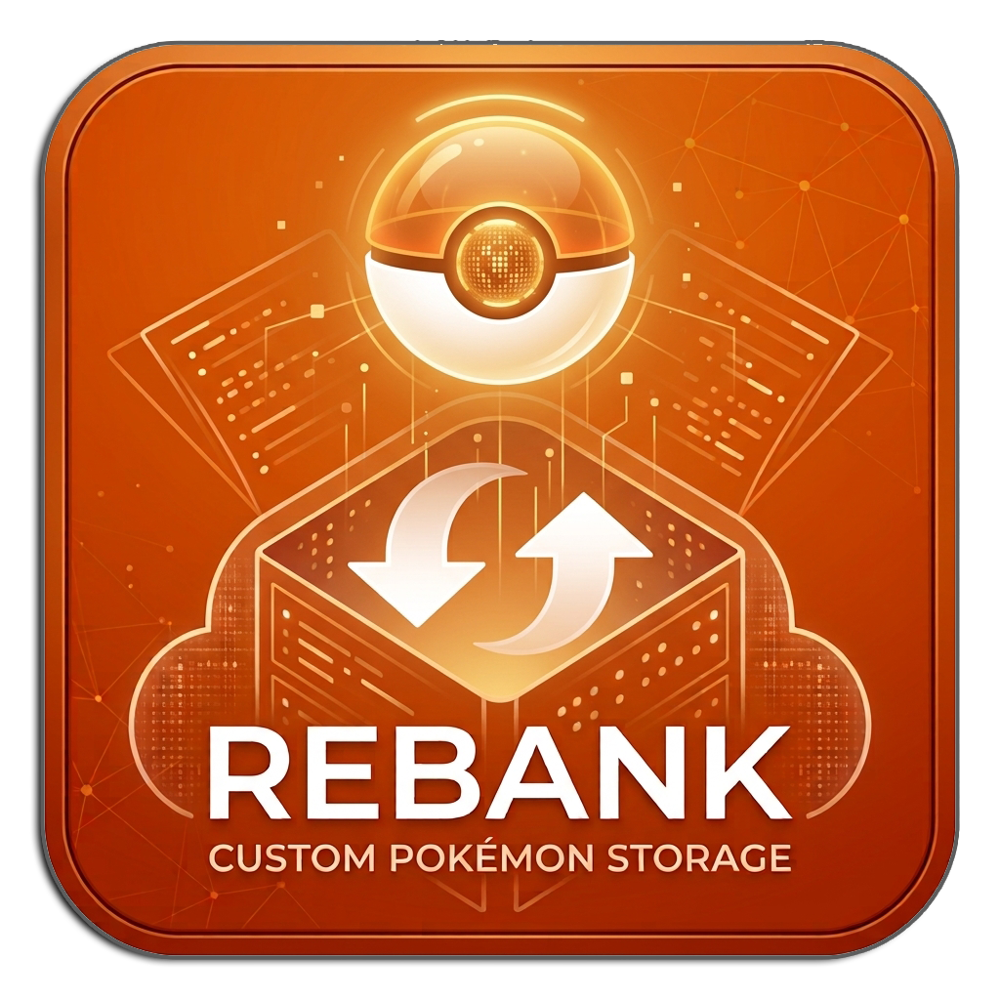
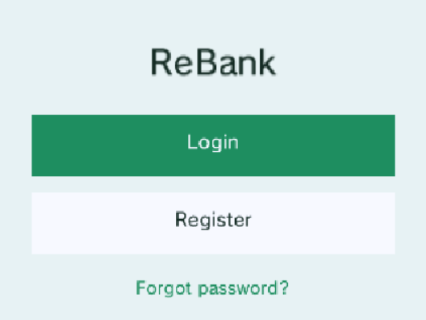
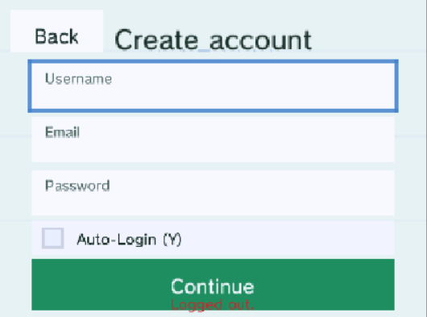
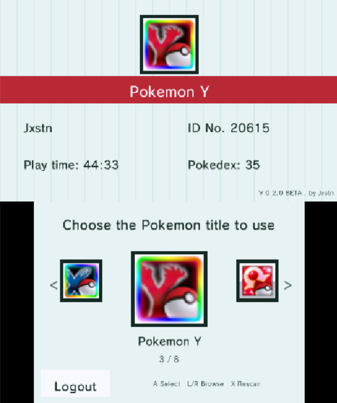
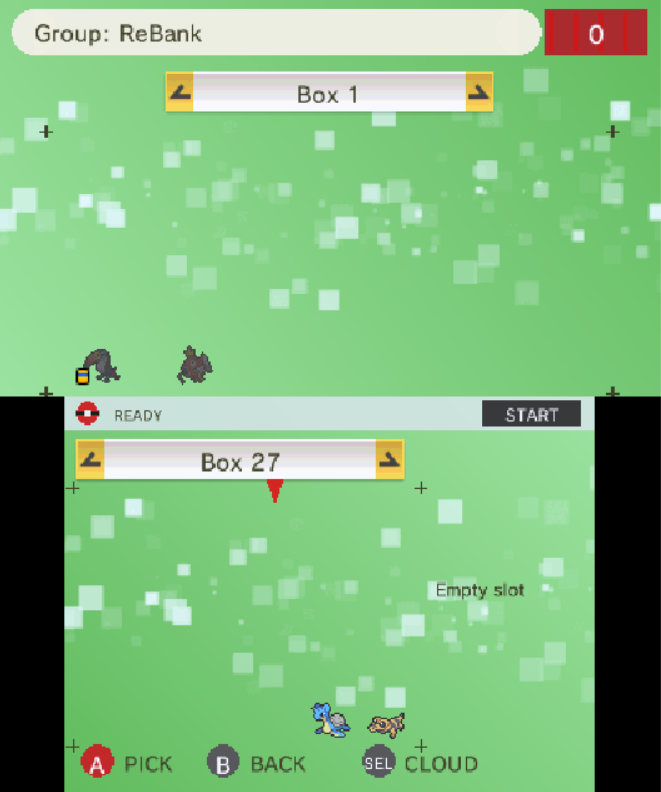

  

  # ReBank

  **Your Pokémon collection, safe in the cloud — right from your 3DS.**

  
  
  

 

## Why ReBank exists

For years, Pokémon Bank was the only official way to store your Pokémon in the cloud and move them freely between games. It was the safety net that let trainers hold onto Pokémon they'd caught, bred, or traded for years — long after the games themselves were retired.

Now Pokémon Bank is being shut down. Without it, a huge part of many trainers' collections would be left stranded on old cartridges, with no safe way to bring them forward.

**ReBank exists to fill that gap.** It's a free, independent cloud storage service for your Pokémon, built entirely for the Nintendo 3DS — no official service required, no subscription, and no collection left behind.

 

## Install in 10 seconds

Have [FBI](https://github.com/Steveice10/FBI) installed? Open it, choose **Remote Install → QR Scan**, and scan this:

  

That link always serves the newest build — the QR code itself never needs to change, even after future updates. It's served over plain HTTP on purpose: the 3DS's built-in certificate store is too outdated to trust most modern HTTPS certificates, which is why FBI remote-install links usually have to be plain HTTP. No FBI? Grab the `.cia`, `.3ds`, or `.3dsx` manually from the **[Releases](../../releases)** page instead.

 

## What you can do right now

| | |
|---|---|
| ☁️ **Cloud storage** | Move Pokémon from your game cartridge into your personal online bank, and pull them back down whenever you want. Your collection stays yours, independent of any single cartridge. |
| 🎮 **Automatic cartridge detection** | Insert or swap a game cartridge and ReBank picks it up on its own — no manual rescan needed. |
| 🎒 **Party support** | View and manage your current party's six Pokémon directly from the bank, right alongside your boxes. |
| 🗑️ **Trash Can** | Drop Pokémon you want gone into the trash box, then commit to delete them all at once — with a confirmation prompt before anything is lost for good. |
| 🗂️ **Custom box names** | Give your cloud boxes their own names, right from the box screen, so a collection of hundreds of Pokémon stays easy to navigate. |
| 🔁 **Cross-generation transfers** | ReBank understands Pokémon from Generation 4 all the way through Generation 7, so your collection isn't locked to a single game or console generation. |
| ✨ **Shiny & held item indicators** | Shiny Pokémon get a star badge and held items get their own icon, right on the box screen — no need to open every Pokémon to check. |
| 🔐 **A safe account of your own** | Sign up with just a username and password. Your session is remembered securely on your device, so you're not stuck logging in every time. |
| 🌍 **Multi-language support** | English, German, French, Spanish, Italian, and Portuguese, selectable right in the app. |

 

## Supported games

ReBank works with save files from:

- **Generation 4** — Diamond, Pearl, Platinum, HeartGold, SoulSilver
- **Generation 5** — Black, White, Black 2, White 2
- **Generation 6** — X, Y, Omega Ruby, Alpha Sapphire
- **Generation 7** — Sun, Moon, Ultra Sun, Ultra Moon

Pokémon can move upward across these generations as you go — catch something in an older game, and it can still make its way into a newer one through your bank.

 

## Screenshots

  <table>
    <tr>
      <td align="center" width="50%">
         
        Login
      </td>
      <td align="center" width="50%">
         
        Creating an account
      </td>
    </tr>
    <tr>
      <td align="center" width="50%">
         
        Picking a game
      </td>
      <td align="center" width="50%">
         
        Your cloud bank
      </td>
    </tr>
  </table>

 

## Getting started

1. Install the app — scan the QR code above with FBI, or grab a file from **[Releases](../../releases)** manually.
2. Open ReBank, create a free account, and select your game.
3. Start moving Pokémon into the cloud.

That's it — no setup, no configuration files, no external accounts needed. Once installed, ReBank also checks for and installs its own updates from within the app.

 

## How far it's come

ReBank has been in active beta since its first public release, with something landing in nearly every update:

- **Early betas (0.1.x)** — the foundation: Gen 4–7 save support, accounts, legality-checked transfers, pinned HTTPS, automatic self-updating, and a string of stability fixes (including tracking down a nasty Bad Egg bug across two generations of games).
- **0.2.0** — a full UI redesign, party team support, cloud box renaming, major performance and reliability work across networking and the commit pipeline, and safer handling that stops failed transfers from ever duplicating or losing a Pokémon.
- **0.2.1** — the Trash Can, for bulk-deleting Pokémon you no longer want.
- **0.2.2** — automatic cartridge detection: swap cartridges freely and ReBank keeps up on its own, plus a large internal refactor to keep the codebase easy to extend.

The full history, with details on every fix and feature, lives on the **[Releases](../../releases)** page.

 

## A project made with care

ReBank is built and maintained independently, by someone who didn't want to see years of collecting disappear along with a shutting-down service. It's still actively growing, with new features, polish, and fixes landing regularly — what you see in the [Releases](../../releases) page is a living, evolving project, not a finished product left to gather dust.

If something breaks, looks off, or could be better, that feedback goes straight into the next update.

 

---

Licensed under [GPLv3](LICENSE). Built on some open-source components — see [NOTICE](NOTICE.md) for details. Pokémon and all related names, images, and data are property of Nintendo, Game Freak, and Creatures Inc. ReBank is an independent fan project, not affiliated with or endorsed by any of them.
